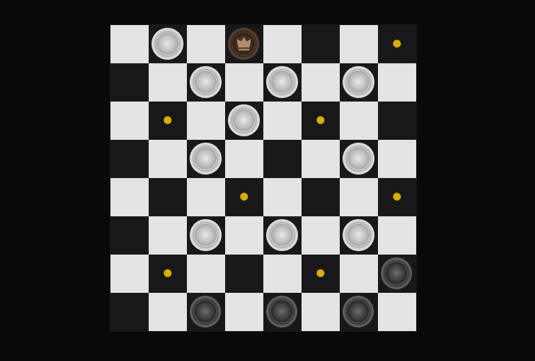

# Checkers Game

A **two-player Checkers** game built with Next.js and TypeScript. This app manages game state and interactions through React hooks such as useState and useEffect, allowing players to enjoy a dynamic and responsive gameplay experience.



## Features

- **Two-player mode:** Players take turns moving pieces across the board.
- **Draw conditions:** Automatically declares a draw if no capture or promotion occurs within a specified number of moves or if only two pieces are left.
- **Game over detection:** The game automatically checks for win/loss conditions, ending the game accordingly.
- **Modern stack:** Developed with Next.js and TypeScript for a highly efficient and type-safe development environment.

## Techstack

- **Next.js:** For building a server-rendered, optimized React app.
- **TypeScript:** For static typing, ensuring a more robust codebase.
- **React:** Used to manage UI components and game state through hooks (useState, useEffect).

## Installation and Setup

- Clone the repository:

    ```bash
    git clone https://github.com/whispnode/nextjs-checkers-game.git
    cd checkers-game
    ```

- Install dependencies:

    ```bash
    npm install
    ```

- Run the development server:

    ```bash
    npm run dev
    ```

- Open [localhost](http://localhost:3000) in your browser to play the game

## Gameplay Rules

- **Objective:** Capture all opponent pieces or leave the opponent without any legal moves.
- **Movement:** Pieces move diagonally, one square at a time. Capture moves can jump over an opponent's piece if a diagonal square is free.
- **Winning Conditions:** A player wins by capturing all opposing pieces or leaving the opponent without any moves.
- **Draw Conditions:**
  - If no capture or promotion occurs within a set number of moves, the game declares a draw.
  - The game also ends in a draw if only two pieces are left (one for each player).

## Project Structure

- **src/components/:** Contains reusable UI components, including the board, pieces, and move indicators.
- **src/models/:** Contains core game logic and rules for handling moves, captures, and win/draw conditions.
- **src/app/game/:** Next.js pages. The main game interface is in game/page.tsx.
- **src/types/:** Type definitions, particularly for the Checkers game state and piece information.

## State Management and Hooks

- **useState:** Manages game variables, including the board state, active player, move counts, and flags like game_over and is_draw.
- **useEffect:** Monitors game state changes to handle draw conditions and to detect game-over scenarios based on specific triggers like remaining pieces or move count.

### Example

The code leverages useEffect to check for draw and game-over conditions as moves progress:

```typescript
useEffect(() => {
        const updateCheckers = { ...checkers };
        if (updateCheckers.board.length !== 0) {
            if (!updateCheckers.game_over) {
                if (updateCheckers.draw_count === LIMITED_DRAW_MAX) {
                    let whitePieces = 0;
                    let blackPieces = 0;

                    // Count the pieces for each player
                    updateCheckers.board.forEach((row) => {
                        row.forEach((piece) => {
                            if (piece !== null) {
                                if (piece.color === "black") blackPieces += 1;
                                if (piece.color === "white") whitePieces += 1;
                            }
                        });
                    });

                    // Check if only two pieces remain (one for each player)
                    if (whitePieces + blackPieces === 2) {
                        updateCheckers.game_over = true;
                        updateCheckers.is_draw = true;
                        setCheckers(updateCheckers);
                    }
                }
            }
        }
    }, [checkers]);
```

## Future Improvements

- AI player: Add a single-player mode against an AI opponent.
- Game history: Track and display the history of moves for analysis or replay.
- Multiplayer mode: Add online play functionality for real-time gameplay.

### Contributing

If you'd like to contribute, please fork the repository and create a pull request with a clear description of your changes. Enjoy playing the Checkers game!
